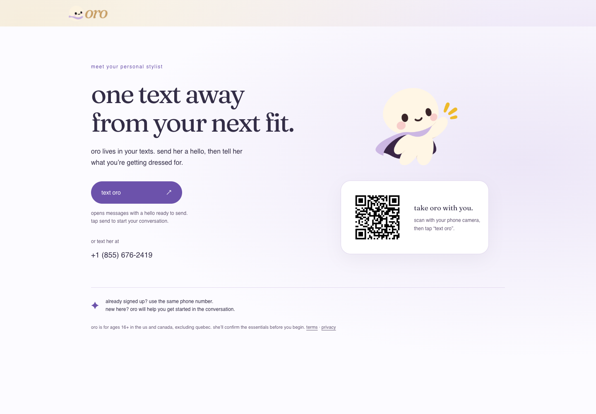
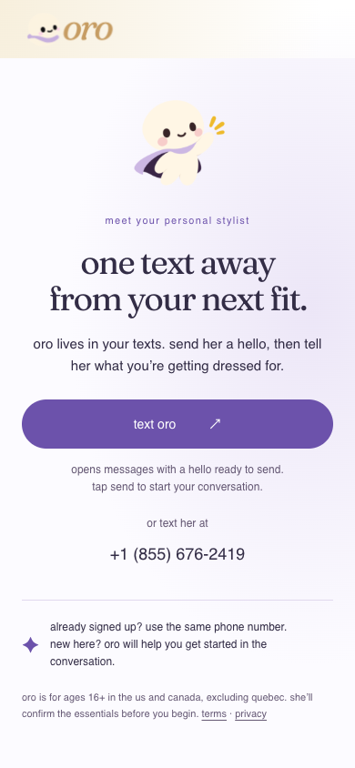

# Text Oro handoff

`/get-started` opens a conversation instead of repeating the signup questionnaire. There is no form, OTP request, or account write on this page. The phone button opens Messages with a greeting; the person still taps Send. Oro confirms missing eligibility and service-texting consent in the conversation before creating their account.

On desktop, the QR opens `https://askoro.now/get-started?from=qr` on the person's phone. That page chooses the SMS draft format for their device. The visible phone number also works as a fallback. This avoids relying on one SMS-body separator working across both iPhone and Android QR scanners.

The screenshots below are real local Chromium renders, with the cookie banner declined and focus moved off the heading. The phone screenshot is a responsive web viewport, not a native Messages screenshot. Browser tests check iPhone/Android user agents, draft links, CTA visibility, and horizontal overflow.

## Desktop · 1440 × 1000

## Phone · 390 × 844

Deploy alongside the backend text-activation change after the open-access PR. Existing email links can continue using `/get-started`. The previous verified questionnaire remains at `/get-started/setup` for explicitly configured beta/legacy modes; it is no longer the public activation flow. Waitlist contact details must be imported on the backend before launch emails to avoid asking those people for their names again.
